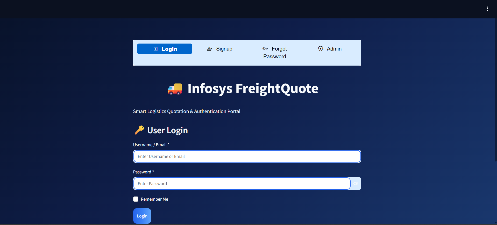
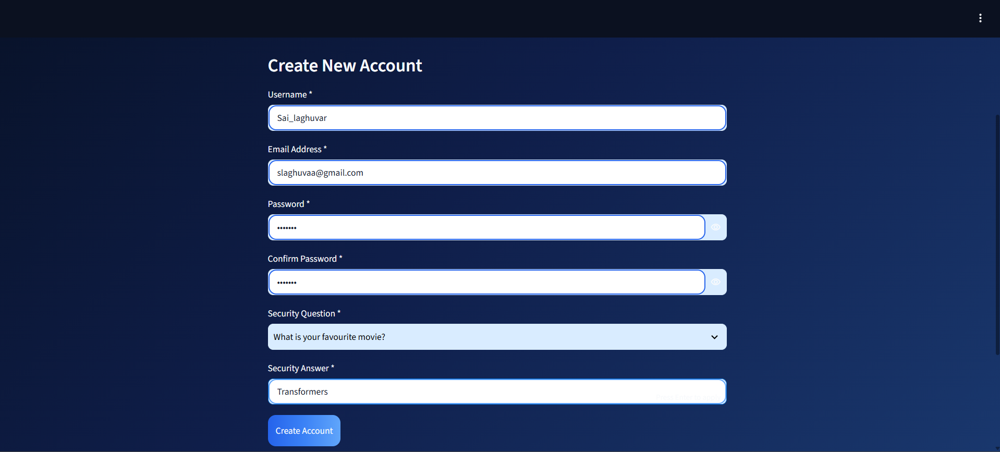
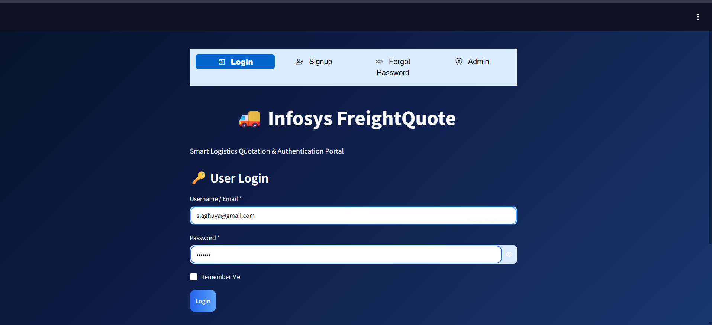

# 🚚 Infosys FreightQuote

A secure user authentication system developed as part of the **Infosys Springboard Virtual Internship**.

The project allows users to create an account, log in securely, recover their password using either a security question or Email OTP, and access a user dashboard. It also includes an Admin panel to view registered users.

---

## Project Overview

This project was built using **Python** and **Streamlit** to demonstrate a secure authentication system with basic cybersecurity practices.

The main focus of this project is to implement:

- User Registration
- Secure Login
- Password Hashing
- JWT Authentication
- Password Recovery
- Email OTP Verification
- Admin Login
- User Dashboard

---


## Features

### 👤 User Registration

- Create a new account
- Username validation
- Email validation
- Strong password validation
- Security Question setup
- Duplicate username and email checking

---


### 🔑 User Login

- Login using Username or Email
- SHA-256 hashed password verification
- JWT token generation after successful login
- Session management

---



### 🔒 Forgot Password

Two recovery options are available:

#### Security Question
- Verify the user's security answer
- Reset password securely


#### Email OTP
- Generate a 6-digit OTP
- Send OTP through Email
- Verify OTP
- Reset password

---

### 🏠 User Dashboard

After successful login, users can:

- View their profile information
- Verify successful JWT authentication
- Logout securely

---

### 🛡 Admin Panel

Admin can:

- Login securely
- View all registered users
- View registered email addresses

---

## Technologies Used

- Python
- Streamlit
- JWT (PyJWT)
- SHA-256 Hashing
- SMTP Email Service
- JSON Database
- HTML & CSS

---

## Project Structure

```
Infosys-FreightQuote/
│
├── app.py
├── requirements.txt
├── users.json
├── otp_storage.json
├── screenshots/
│   ├── login.png
│   ├── signup.png
│   ├── forgot_security.png
│   ├── forgot_otp.png
│   ├── otp_email.png
│   ├── dashboard.png
│   └── admin.png
│
├── README.md
└── Infosys_FreightQuote.ipynb
```

---

## How to Run

1. Install all required packages

```
pip install -r requirements.txt
```

2. Run the application

```
streamlit run app.py
```

3. Open the Streamlit URL in your browser.

---

# Screenshots

## Login Page

*(Add Login Screenshot here)*


---

## Signup Page

*(Add Signup Screenshot here)*


---

## Forgot Password - Security Question

*(Add Security Question Screenshot here)*


---

## Forgot Password - Email OTP

*(Add Email OTP Screenshot here)*


---

## OTP Received in Email

*(Add OTP Email Screenshot here)*


---

## User Dashboard

*(Add Dashboard Screenshot here)*


---

## Admin Dashboard

*(Add Admin Screenshot here)*


---

## Future Improvements

- Better Dashboard UI
- OTP Expiry Timer
- User Profile Management
- Database Integration
- Multi-Factor Authentication (MFA)

---

## Developed By

**Sai Laghuvar**

Infosys Springboard Virtual Internship 7.0
